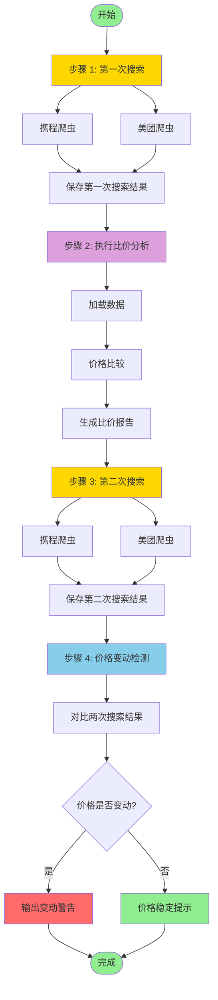

# Pipeline 流程图

## 说明

- **步骤 1**: 第一次搜索，获取初始价格数据
- **步骤 2**: 执行比价分析，生成比价报告
- **步骤 3**: 第二次搜索，获取最新价格数据
- **步骤 4**: 对比两次搜索结果，检测价格变动

## 查看方式

1. 在 VS Code 中安装 "Markdown Preview Mermaid Support" 插件
2. 在 GitHub/GitLab 等平台查看（自动渲染）
3. 使用在线工具：https://mermaid.live/
