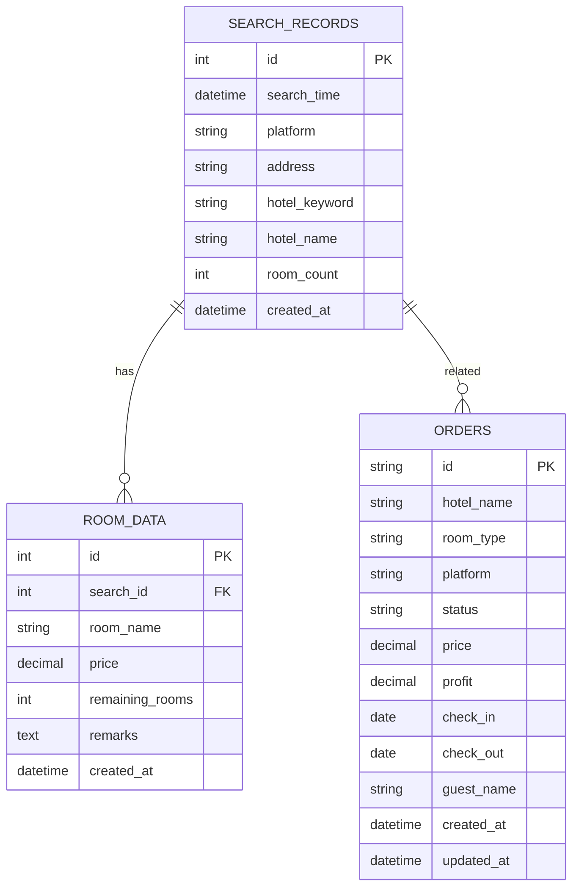

# 酒店爬虫与订单管理系统 - 设计文档

## 1. 项目概述

### 1.1 项目简介

本项目是一个基于 Python 的酒店信息爬取、价格比较、订单处理和自动上架的综合管理系统。系统通过 RPA（机器人流程自动化）技术，实现了多平台酒店数据的自动化采集、智能比价、订单处理和代理通平台自动上架等功能。

### 1.2 核心功能

- **多平台酒店数据爬取**：支持携程、美团、飞猪等主流平台
- **智能价格比较**：三维匹配算法（房间类型+窗户+早餐）
- **订单自动处理**：从代理通获取订单，自动比价并在低价平台下单
- **代理通自动上架**：根据比价结果自动上架有利润的房型
- **Web 管理平台**：提供可视化的数据管理和监控界面
- **价格监控**：实时监控价格变动，及时预警

### 1.3 技术栈

- **编程语言**：Python 3.x
- **Web 框架**：Flask
- **浏览器自动化**：Selenium、Playwright
- **数据库**：SQLite（本地）、MySQL（云数据库）
- **前端技术**：HTML5 + CSS3 + JavaScript（原生）

## 2. 系统架构

### 2.1 整体架构

系统分为几个主要部分，简单来说就是：

```
用户通过网页操作
    ↓
Web管理平台（显示订单、价格、比价报告等）
    ↓
业务服务（处理订单、搜索、比价等业务逻辑）
    ↓
功能模块（爬虫、比价、订单处理、上架等具体功能）
    ↓
数据库操作（保存和读取数据）
    ↓
数据库（SQLite/MySQL/JSON文件）
```

**举个例子**：用户想查看订单列表
1. 用户在网页上点击"查看订单"
2. Web管理平台接收这个请求
3. 订单服务处理这个请求
4. 订单处理模块去数据库查找订单
5. 数据库操作层从MySQL读取订单数据
6. 数据返回给用户，显示在网页上

**主要模块说明**：

1. **Web管理平台**：用户看到的网页界面，包括订单管理、价格监控、比价报告、系统配置等功能

2. **业务服务**：
   - 订单服务：处理订单相关的业务逻辑
   - 搜索服务：处理搜索相关的业务逻辑
   - 比价服务：处理比价相关的业务逻辑
   - 爬虫服务：处理爬虫相关的业务逻辑

3. **功能模块**：
   - 爬虫模块：从携程、美团、飞猪等平台爬取酒店数据
   - 比价模块：比较不同平台的价格
   - 订单处理模块：处理订单的获取、下单等
   - 上架模块：在代理通平台上架房型
   - 流程编排：协调多个步骤的执行

4. **数据库操作**：统一处理数据的保存和读取，不管用的是SQLite还是MySQL

5. **数据库**：
   - SQLite：开发时用的本地数据库
   - MySQL：生产环境用的数据库
   - JSON文件：临时存储爬取的数据

### 2.2 模块划分

#### 2.2.1 爬虫模块

**目录结构**：
```
Rpa/
├── xiecheng/          # 携程爬虫
│   ├── ctrip_crawler.py
│   └── ctrip_cookies.py
├── meituan/           # 美团爬虫
│   ├── meituan_rpa.py
│   └── meituan_cookies.py
├── feizhu/            # 飞猪爬虫
│   ├── feizhu_rpa.py
│   └── cookies.py
└── search.py          # 统一搜索入口
```

**功能说明**：
- **携程爬虫**：使用 Selenium 自动化浏览器，支持本地用户数据保持登录态
- **美团爬虫**：使用 Playwright，支持 H5 移动端页面，通过 Cookies 保持登录态
- **飞猪爬虫**：使用 Selenium，支持本地用户数据和 Cookies 双重登录态
- **统一搜索**：`search.py` 提供统一入口，支持并行或串行执行多个爬虫

**数据输出**：
- 携程：`xiecheng/hotel_data.json`
- 美团：`meituan/meituan_hotel.json`
- 飞猪：`feizhu/feizhu_hotel.json`

#### 2.2.2 比价模块

**核心文件**：`price_comparison.py`

**功能特点**：
- **三维匹配算法**：
  - 房间类型：单人房、大床房、双床房、三人间
  - 窗户类型：有窗、无窗
  - 早餐类型：无早餐、含1份早餐、含2份早餐、含3份早餐
- **价格分析**：
  - 计算价格差和价格差百分比
  - 利润判断（价差>20%认为有利润）
  - 预警机制（价格差超过阈值时预警）
- **报告生成**：生成 Markdown 格式的比价报告

**关键类**：
- `RoomTypeMapper`：房型映射器，从房型名称中提取三维信息
- `PriceComparator`：价格比较器，执行比价逻辑
- `DataLoader`：数据加载器，加载和解析 JSON 数据

#### 2.2.3 订单处理模块

**核心文件**：`orders/order_processor.py`

**业务流程**：
1. 从代理通平台获取订单信息
2. 解析订单（酒店、房型、入住人、日期等）
3. 调用 `search.py` 搜索酒店价格
4. 使用三维匹配算法比价
5. 在价格最低的平台自动下单
6. 记录订单状态和利润

**关键类**：
- `OrderInfo`：订单信息数据类
- `OrderStorage`：订单存储管理
- `DailitongOrderFetcher`：代理通订单获取器
- `OrderProcessor`：订单处理器主类

**订单状态**：
- `PENDING`：待处理
- `PROCESSING`：处理中
- `BOOKED`：已预订
- `CONFIRMED`：已确认
- `FAILED`：下单失败
- `CANCELLED`：已取消
- `COMPLETED`：已完成

#### 2.2.4 上架模块

**核心文件**：
- `shangjia/shangjia_rpa.py`：代理通自动上架 RPA
- `auto_shangjia.py`：自动比价上架脚本

**功能特点**：
- 支持批量上架多个酒店
- 支持多渠道选择（Trip、Qunar、B2B等）
- 支持多房型批量操作
- 支持日期范围选择
- 支持价格、库存、开关房等操作
- 自动截图记录操作过程

**工作流程**：
1. 调用 `price_comparison.py` 进行比价
2. 筛选出有利润的房型
3. 映射到代理通房型名称
4. 调用 `shangjia_rpa.py` 自动上架

#### 2.2.5 流程编排模块

**核心文件**：`pipeline.py`

**工作流程**：
1. **第一次搜索**：获取初始价格数据
2. **执行比价分析**：生成比价报告
3. **第二次搜索**：获取最新价格数据
4. **价格变动检测**：对比两次搜索结果，检测价格变动

**价格变动判断规则**：
- 价格变化 ≥ 30 元 或 变化比例 ≥ 5%，则认为"价格发生变动"
- 检测房间状态变化（从有房变为满房）

#### 2.2.6 Web 管理平台

**核心文件**：
- `web_admin.py`：启动入口
- `web_admin_app/`：应用模块
  - `app_factory.py`：应用工厂
  - `auth.py`：用户认证
  - `rpa_routes.py`：RPA 相关 API
  - `crawl_tasks.py`：任务中心管理
  - `metatree_tasks.py`：Metatree 任务管理
  - `ui.py`：UI 路由

**功能模块**：
- **数据概览**：总订单数、总利润统计、订单状态分布、平台分布
- **订单管理**：查看、筛选、更新订单状态
- **价格监控**：查看搜索历史记录、房型详情
- **比价报告**：查看最新的比价分析报告
- **系统配置**：查看数据库配置信息

**API 接口详细设计**：

#### GET /api/orders
**功能**：获取订单列表

**请求参数**：
- `page` (int, 可选): 页码，默认1
- `page_size` (int, 可选): 每页数量，默认20，最大100
- `status` (string, 可选): 订单状态筛选（PENDING、PROCESSING、BOOKED等）
- `platform` (string, 可选): 平台筛选（ctrip、meituan、feizhu）
- `start_date` (string, 可选): 开始日期，格式：YYYY-MM-DD
- `end_date` (string, 可选): 结束日期，格式：YYYY-MM-DD

**响应格式**：
```json
{
  "success": true,
  "data": {
    "orders": [
      {
        "id": "order_001",
        "hotel_name": "XX酒店",
        "room_type": "大床房",
        "platform": "ctrip",
        "status": "BOOKED",
        "price": 299.0,
        "profit": 50.0,
        "created_at": "2025-01-15T10:30:00"
      }
    ],
    "total": 100,
    "page": 1,
    "page_size": 20,
    "total_pages": 5
  }
}
```


#### GET /api/orders/<order_id>
**功能**：获取订单详情

**路径参数**：
- `order_id` (string, 必需): 订单ID

**响应格式**：
```json
{
  "success": true,
  "data": {
    "id": "order_001",
    "hotel_name": "XX酒店",
    "room_type": "大床房-有窗-含2份早餐",
    "platform": "ctrip",
    "status": "BOOKED",
    "price": 299.0,
    "profit": 50.0,
    "check_in": "2025-01-20",
    "check_out": "2025-01-22",
    "guest_name": "张三",
    "created_at": "2025-01-15T10:30:00",
    "updated_at": "2025-01-15T10:35:00"
  }
}
```

#### PUT /api/orders/<order_id>
**功能**：更新订单状态

**路径参数**：
- `order_id` (string, 必需): 订单ID

**请求体**：
```json
{
  "status": "CONFIRMED",
  "notes": "订单已确认"
}
```

**响应格式**：
```json
{
  "success": true,
  "message": "订单更新成功",
  "data": {
    "id": "order_001",
    "status": "CONFIRMED"
  }
}
```

#### GET /api/search-records
**功能**：获取搜索记录列表

**请求参数**：
- `page` (int, 可选): 页码，默认1
- `page_size` (int, 可选): 每页数量，默认20
- `platform` (string, 可选): 平台筛选
- `hotel_keyword` (string, 可选): 酒店关键词筛选

**响应格式**：
```json
{
  "success": true,
  "data": {
    "records": [...],
    "total": 50,
    "page": 1,
    "page_size": 20
  }
}
```

#### GET /api/statistics
**功能**：获取统计数据

**响应格式**：
```json
{
  "success": true,
  "data": {
    "total_orders": 1000,
    "total_profit": 50000.0,
    "status_distribution": {
      "PENDING": 10,
      "PROCESSING": 5,
      "BOOKED": 800,
      "CONFIRMED": 150,
      "FAILED": 20,
      "COMPLETED": 15
    },
    "platform_distribution": {
      "ctrip": 500,
      "meituan": 300,
      "feizhu": 200
    }
  }
}
```

#### GET /api/price-comparison
**功能**：获取最新的比价报告

**响应格式**：
```json
{
  "success": true,
  "data": {
    "report_path": "reports/comparison_20250115.md",
    "generated_at": "2025-01-15T10:00:00",
    "summary": {
      "total_rooms": 50,
      "profitable_rooms": 30,
      "profit_rate": 60.0
    }
  }
}
```

#### 2.2.7 数据库模块

**核心文件**：`database/db_utils.py`

**支持数据库**：
- **SQLite**：本地开发使用
- **MySQL**：生产环境使用（支持云数据库）

**数据库ER图**：



**数据表结构详细说明**：

**search_records（搜索记录表）**：
- `id` (INT, PRIMARY KEY, AUTO_INCREMENT): 主键，自增
- `search_time` (DATETIME, NOT NULL, INDEX): 搜索时间，建立索引用于按时间查询
- `platform` (VARCHAR(50), NOT NULL, INDEX): 平台名称（ctrip、meituan、feizhu），建立索引用于平台筛选
- `address` (VARCHAR(200)): 搜索地址
- `hotel_keyword` (VARCHAR(100), INDEX): 酒店关键词，建立索引用于关键词搜索
- `hotel_name` (VARCHAR(200)): 酒店名称
- `room_count` (INT, DEFAULT 0): 房型数量
- `created_at` (DATETIME, NOT NULL, DEFAULT CURRENT_TIMESTAMP): 创建时间

**room_data（房型数据表）**：
- `id` (INT, PRIMARY KEY, AUTO_INCREMENT): 主键，自增
- `search_id` (INT, NOT NULL, FOREIGN KEY, INDEX): 搜索记录ID，外键关联search_records.id，建立索引用于关联查询
- `room_name` (VARCHAR(200), NOT NULL): 房型名称
- `price` (DECIMAL(10,2), NOT NULL): 价格
- `remaining_rooms` (INT, DEFAULT 0): 剩余房间数
- `remarks` (TEXT): 备注信息
- `created_at` (DATETIME, NOT NULL, DEFAULT CURRENT_TIMESTAMP): 创建时间

**orders（订单表）**：
- `id` (VARCHAR(50), PRIMARY KEY): 订单ID，业务主键
- `hotel_name` (VARCHAR(200), NOT NULL): 酒店名称
- `room_type` (VARCHAR(200), NOT NULL): 房型描述
- `platform` (VARCHAR(50), NOT NULL, INDEX): 下单平台，建立索引用于平台筛选
- `status` (VARCHAR(20), NOT NULL, INDEX): 订单状态，建立索引用于状态筛选
- `price` (DECIMAL(10,2), NOT NULL): 订单价格
- `profit` (DECIMAL(10,2), DEFAULT 0): 利润
- `check_in` (DATE): 入住日期
- `check_out` (DATE): 退房日期
- `guest_name` (VARCHAR(100)): 入住人姓名
- `created_at` (DATETIME, NOT NULL, DEFAULT CURRENT_TIMESTAMP, INDEX): 创建时间，建立索引用于时间排序
- `updated_at` (DATETIME, NOT NULL, DEFAULT CURRENT_TIMESTAMP ON UPDATE CURRENT_TIMESTAMP): 更新时间

**索引设计说明**：

1. **search_records表索引**：
   - `idx_search_time`: 用于按时间范围查询搜索记录
   - `idx_platform`: 用于按平台筛选
   - `idx_hotel_keyword`: 用于按酒店关键词搜索

2. **room_data表索引**：
   - `idx_search_id`: 外键索引，用于关联查询和JOIN操作

3. **orders表索引**：
   - `idx_platform`: 用于按平台筛选订单
   - `idx_status`: 用于按状态筛选订单
   - `idx_created_at`: 用于按创建时间排序和查询

**表关系说明**：
- `room_data.search_id` → `search_records.id`：一对多关系，一个搜索记录对应多个房型数据
- 外键约束：`ON DELETE CASCADE`，删除搜索记录时自动删除关联的房型数据

**配置方式**：
- 环境变量：`DB_TYPE`、`DB_HOST`、`DB_USER`、`DB_PASSWORD`、`DB_NAME`、`DB_PORT`
- 配置文件：`database/db_config.json`（不提交到版本控制）

## 3. 核心算法

### 3.1 三维匹配算法

**目标**：在多个平台之间找到相同规格的房型进行价格比较。

**匹配维度**：
1. **房间类型**：单人房、大床房、双床房、三人间
2. **窗户类型**：有窗、无窗
3. **早餐类型**：无早餐、含1份早餐、含2份早餐、含3份早餐

**工作流程**：

1. **提取房型信息**：
   - 从房型名称中识别房间类型、窗户类型、早餐类型
   - 用关键词匹配和规则识别这些信息
   - 把识别结果组合成 `(房间类型, 窗户, 早餐)` 这样的信息

2. **计算匹配程度**：
   - 完全匹配：三个信息都一致，匹配度 = 100%
   - 部分匹配：房间类型+早餐一致，匹配度 = 80%
   - 基础匹配：只有房间类型一致，匹配度 = 50%

3. **匹配策略**（逐步放宽条件）：
   - **第一步**：优先找完全匹配的（三个信息都一致）
   - **第二步**：如果找不到，忽略窗户条件，只匹配房间类型+早餐
   - **第三步**：如果还找不到，只匹配房间类型

4. **选择最佳匹配**：
   - 把所有可能的匹配按匹配度从高到低排序
   - 选择匹配度最高的
   - 如果最高匹配度 < 50%，认为匹配失败

**性能说明**：
- **计算时间**：如果有n个房型，需要比较 n×n 次，所以时间会随房型数量平方增长
- **内存占用**：需要存储每个房型的信息和匹配结果，内存占用和房型数量成正比

**特殊情况处理**：

1. **房型名称信息不全**：
   - 如果看不出有没有窗户，默认当作"有窗"
   - 如果看不出有没有早餐，默认当作"无早餐"
   - 记录到日志，提醒信息不完整

2. **不同平台房型名称差别大**：
   - 建立同义词表（比如"大床房"、"双人大床房"、"标准大床房"都算同一种）
   - 用相似度算法找最接近的
   - 可以人工标记，慢慢完善匹配规则

3. **匹配失败怎么办**：
   - 把匹配失败的房型记录到日志
   - 在比价报告中标记为"无法匹配"
   - 提供手动匹配功能，可以人工指定匹配关系

**实现位置**：`price_comparison.py` 中的 `RoomTypeMapper` 类

**实现思路**（伪代码）：
```python
# 匹配两个平台的房型
def match_rooms(平台A的房型列表, 平台B的房型列表):
    匹配结果 = []
    
    # 遍历平台A的每个房型
    for 房型A in 平台A的房型列表:
        提取房型A的信息（房间类型、窗户、早餐）
        最佳匹配 = None
        最高匹配度 = 0
        
        # 在平台B中找最匹配的
        for 房型B in 平台B的房型列表:
            提取房型B的信息
            计算匹配度
            
            if 匹配度 > 最高匹配度:
                最高匹配度 = 匹配度
                最佳匹配 = 房型B
        
        # 如果匹配度够高，就记录这个匹配
        if 最高匹配度 >= 50%:
            匹配结果.append((房型A, 最佳匹配, 最高匹配度))
    
    return 匹配结果
```

### 3.2 价格变动检测算法

**检测规则**：
- 绝对变动阈值：≥ 30 元
- 相对变动阈值：≥ 5%

**判断逻辑**：
```python
is_changed = (price_diff_abs >= 30.0 or 
              price_change_percent >= 5.0)
```

**实现位置**：`pipeline.py` 中的 `detect_single_price_change` 函数

### 3.3 利润判断算法

**判断规则**：
- 价差百分比 > 20%：认为有利润
- 价差百分比 ≤ 20%：认为无利润

**实现位置**：`price_comparison.py` 中的 `PriceComparator` 类

## 4. 数据流

### 4.1 搜索流程

```
用户输入搜索条件
    ↓
search.py（统一入口）
    ↓
    ├─→ 携程爬虫（并行）
    └─→ 美团爬虫（并行）
    ↓
保存到 JSON 文件
    ↓
保存到数据库（可选）
```

### 4.2 比价流程

```
加载 JSON 数据
    ↓
解析房型信息（三维匹配）
    ↓
执行比价算法
    ↓
生成比价报告（Markdown）
```

### 4.3 订单处理流程

```
从代理通获取订单
    ↓
解析订单信息
    ↓
调用 search.py 搜索价格
    ↓
三维匹配比价
    ↓
判断是否有利润
    ↓
在低价平台下单
    ↓
更新订单状态
```

### 4.4 Pipeline 完整流程

```
开始
  ↓
第一次搜索（获取初始价格）
  ↓
执行比价分析
  ↓
第二次搜索（获取最新价格）
  ↓
价格变动检测
  ↓
输出变动警告
  ↓
完成
```

## 5. 部署架构

### 5.1 本地开发环境

**配置**：
- 数据库：SQLite
- 浏览器：本地 Chrome/Chromium
- 端口：5000（Web 管理平台）

**启动方式**：
```bash
# 启动 Web 管理平台
python web_admin.py

# 或使用批处理文件（Windows）
start_web_admin.bat
```

### 5.2 生产环境（云服务器）

**配置**：
- 数据库：MySQL（云数据库）
- 浏览器：Chromium（无头模式）
- 部署方式：Docker

**Docker 配置**：

**Dockerfile 示例**：
```dockerfile
FROM python:3.9-slim

WORKDIR /app

# 安装系统依赖
RUN apt-get update && apt-get install -y \
    chromium \
    chromium-driver \
    && rm -rf /var/lib/apt/lists/*

# 安装Python依赖
COPY requirements.txt .
RUN pip install --no-cache-dir -r requirements.txt

# 复制应用代码
COPY . .

# 设置环境变量
ENV PYTHONUNBUFFERED=1
ENV CHROMIUM_PATH=/usr/bin/chromium

# 暴露端口
EXPOSE 5000

# 启动命令
CMD ["python", "web_admin.py"]
```

**docker-compose.yml 示例**：
```yaml
version: '3.8'

services:
  web:
    build: .
    ports:
      - "5000:5000"
    environment:
      - DB_TYPE=mysql
      - DB_HOST=mysql_host
      - DB_USER=root
      - DB_PASSWORD=${DB_PASSWORD}
      - DB_NAME=hotel_data
    volumes:
      - ./logs:/app/logs
      - ./screenshots:/app/screenshots
      - ./cookies:/app/cookies
    depends_on:
      - mysql
    restart: unless-stopped

  mysql:
    image: mysql:8.0
    environment:
      - MYSQL_ROOT_PASSWORD=${MYSQL_ROOT_PASSWORD}
      - MYSQL_DATABASE=hotel_data
    volumes:
      - mysql_data:/var/lib/mysql
      - ./database/init.sql:/docker-entrypoint-initdb.d/init.sql
    restart: unless-stopped

volumes:
  mysql_data:
```

**部署步骤**：
1. 在服务器上安装 Docker 和 Docker Compose
2. 配置环境变量（`.env`文件）：
   ```
   DB_PASSWORD=your_password
   MYSQL_ROOT_PASSWORD=your_root_password
   ```
3. 配置数据库连接（`database/db_config.json`）
4. 运行部署命令：
   ```bash
   docker-compose up -d
   ```

### 5.3 数据备份（规划中）

**备份方案**：
- 定期备份数据库（建议每天备份一次）
- 备份文件保存到安全的地方（本地+云存储）
- 保留最近一段时间的备份（建议30天）

**恢复方案**：
- 如果数据丢失，可以从备份恢复
- 建议定期测试恢复流程，确保备份可用

> **说明**：这是生产环境部署时的建议方案，目前还在规划中。开发环境可以手动备份数据库。

### 5.4 扩容说明（规划中）

如果系统使用的人多了，性能不够用时，可以考虑：

1. **增加服务器**：部署多个服务实例，分担压力
2. **提升服务器配置**：增加CPU和内存
3. **优化数据库**：增加数据库连接数，启用缓存

> **说明**：这是未来系统规模扩大时的规划方案，目前单机部署即可满足需求。

## 6. 安全设计

### 6.1 登录态管理

**Cookies 保存**：
- 各平台爬虫支持 Cookies 保存和加载
- Cookies 文件保存在项目目录，不提交到版本控制
- Cookies 文件权限设置为 600（仅所有者可读写）

**登录态验证**：
- 启动时自动检测 Cookies 是否有效
- 失效时自动重新登录
- 支持 Cookies 过期时间检查

### 6.2 数据库安全

**配置管理**：
- 敏感信息（密码、密钥）通过环境变量或配置文件管理
- 配置文件不提交到版本控制（使用 `.example` 文件作为模板）

### 6.3 Web 平台安全

**用户认证**：
- 支持用户注册和登录
- 使用 Flask session 管理用户状态
- API 接口需要登录验证

**爬虫防护**：
- 控制请求频率，避免被目标网站封禁
- 使用浏览器自动化工具模拟真实用户操作

## 7. 扩展性设计

### 7.1 新平台接入

**步骤**：
1. 在对应目录创建爬虫模块（如 `new_platform/new_platform_rpa.py`）
2. 实现统一的接口（搜索、数据解析）
3. 在 `search.py` 中添加调用逻辑
4. 在 `price_comparison.py` 中添加平台支持

### 7.2 新功能扩展

**扩展方式**：
- 各模块采用模块化设计，添加新功能时只需要添加对应的模块
- 爬虫模块支持自定义配置（选择器、等待时间等）
- Web平台添加新功能时，创建对应的功能模块即可

## 8. 性能优化

### 8.1 性能说明

**性能特点**：
- 支持多平台并行搜索，提高效率
- 比价计算速度快，可以快速处理大量房型数据
- 支持并发处理多个任务
- Web接口响应速度快，用户体验好

### 8.2 并发处理

**搜索并发**：
- `search.py` 支持并行执行多个爬虫
- 使用 `ThreadPoolExecutor` 实现并发
- 最大并发数：10个任务
- 使用信号量控制资源占用

**数据库优化**：
- 使用索引优化查询性能
- 支持连接池（MySQL，最大连接数：20）
- 查询结果缓存（Redis，可选）
- 慢查询日志记录和优化

### 8.3 缓存机制

**Cookies 缓存**：
- 各平台 Cookies 持久化保存
- 减少重复登录
- Cookies 有效期检查

**数据缓存**：
- JSON 文件缓存爬取结果
- 减少重复爬取
- 缓存有效期：30分钟

**Redis 缓存（可选）**：
- 缓存热点数据（订单列表、统计数据）
- 缓存有效期：5分钟
- 缓存失效策略：LRU（最近最少使用）

## 9. 监控与日志

### 9.1 日志系统

**日志系统**：
- 记录系统运行日志
- 记录错误信息
- 日志保存到文件

### 9.2 错误处理

**异常捕获**：
- 各模块包含完整的异常处理
- 错误信息记录到日志
- 使用具体的异常类型（避免使用 `except Exception`）

**异常分类**：
- 业务异常：比如订单不存在、状态不允许操作等
- 参数异常：比如参数格式错误、缺少必需参数等
- 网络异常：比如请求超时、连接失败等
- 数据库异常：比如数据库连接失败、查询失败等

**重试机制**：
- 网络请求失败时自动重试（最多3次，每次等待时间逐渐增加）
- 浏览器操作失败时自动重试（最多2次）
- 数据库连接失败时自动重试（最多3次）

**服务降级**（出问题时怎么办）：
- 爬虫失败时：返回之前缓存的数据，或者返回空结果
- 数据库不可用时：如果可能就用只读模式，否则返回错误提示
- 外部服务不可用时：使用默认值，或者暂时跳过这个功能

### 9.3 监控说明

**监控内容**：
- 记录系统运行状态
- 记录业务数据（订单、搜索记录等）
- 通过日志查看系统运行情况

### 9.5 截图记录

**自动截图**：
- 关键操作自动截图（登录、搜索、下单）
- 失败时保存错误截图
- 截图保存在 `screenshots/` 目录
- 截图命名：`{platform}_{action}_{timestamp}.png`
- 截图保留：最近7天

## 10. 测试

### 10.1 测试说明

**测试工具**：
- `test_browser.py`：浏览器测试
- `test_shangjia.py`：上架功能测试
- `database/test_connection.py`：数据库连接测试

## 11. 文档

### 11.1 用户文档

- `README.md`：项目概述和快速开始
- `WEB_ADMIN_QUICKSTART.md`：Web 管理平台快速开始
- 各模块 README：
  - `meituan/README_MEITUAN.md`
  - `feizhu/README_FEIZHU.md`
  - `shangjia/README_SHANGJIA.md`

### 11.2 开发文档

- `pipeline_flowchart.md`：Pipeline 流程图
- `price_comparison_report.md`：比价报告示例
- `设计文档.md`：本文档

## 12. 未来规划

### 12.1 功能增强

- [ ] 支持更多平台（如高德、去哪儿等）
- [ ] 支持定时任务调度
- [ ] 支持邮件/短信通知
- [ ] 支持 Excel 批量导入任务
- [ ] 支持价格预测算法

### 12.2 技术优化

- [ ] 引入消息队列（如 Redis）处理异步任务
- [ ] 引入分布式爬虫框架（如 Scrapy）
- [ ] 优化数据库查询性能
- [ ] 支持 Docker 容器化部署

### 12.3 用户体验

- [ ] Web 平台支持实时数据更新
- [ ] 支持数据可视化图表
- [ ] 支持移动端访问
- [ ] 支持多语言

### 12.4 安全增强（后续预期）

**数据库安全**：
- [ ] MySQL 支持 SSL 连接
- [ ] 敏感数据加密存储（AES-256）
- [ ] 使用密钥管理服务管理敏感信息
- [ ] 数据库备份文件加密

**Web平台安全**：
- [ ] JWT Token 认证
- [ ] CSRF 防护（跨站请求伪造防护）
- [ ] XSS 防护（跨站脚本攻击防护）
- [ ] 输入验证和输出转义
- [ ] 请求频率限制（防止恶意攻击）

**安全审计**：
- [ ] 定期安全扫描
- [ ] 代码安全审查
- [ ] 依赖包漏洞检查
- [ ] 访问日志监控和异常检测

### 12.5 监控和告警（后续预期）

**系统监控**：
- [ ] CPU、内存、磁盘使用率监控
- [ ] 数据库连接数监控
- [ ] 请求响应时间监控
- [ ] 错误率监控

**业务监控**：
- [ ] 爬虫成功率监控
- [ ] 订单处理成功率监控
- [ ] 比价准确率监控
- [ ] 价格变动频率监控

**告警系统**：
- [ ] 告警规则配置
- [ ] 邮件/短信/企业微信告警通知
- [ ] 告警去重和恢复通知

### 12.6 测试完善（后续预期）

**测试体系**：
- [ ] 完善的单元测试（覆盖率目标80%）
- [ ] 集成测试
- [ ] 性能测试（压力测试、负载测试）
- [ ] 自动化测试（CI/CD集成）

## 13. 附录

### 13.1 依赖列表

**核心依赖**：
- `selenium>=4.0.0`：浏览器自动化
- `webdriver-manager>=4.0.0`：WebDriver 管理
- `playwright>=1.40.0`：Playwright 浏览器自动化
- `flask>=2.0.0`：Web 框架
- `flask-cors>=3.0.0`：CORS 支持
- `pymysql>=1.1.0`：MySQL 驱动
- `pyyaml>=6.0`：YAML 配置解析

**可选依赖**：
- `colorama>=0.4.6`：终端颜色输出
- `tqdm>=4.66.0`：进度条显示

### 13.2 配置文件说明

**数据库配置**（`database/db_config.json`）：
```json
{
  "db_type": "mysql",
  "mysql": {
    "host": "localhost",
    "port": 3306,
    "user": "root",
    "password": "password",
    "database": "hotel_data",
    "charset": "utf8mb4"
  }
}
```

**代理通配置**（`shangjia/config.yaml`）：
```yaml
login:
  url: "https://www.vipdlt.com"
  username: "username"
  password: "password"

task:
  hotels:
    - "酒店名称"
  channels:
    - "Trip"
  room_types:
    - "大床房"
  date_start: "2025-01-01"
  date_end: "2025-12-31"
  action: "price"
  value: 968
```

### 13.3 常见问题

**Q: 浏览器启动失败？**
A: 检查 ChromeDriver 版本是否匹配，确保关闭所有 Chrome 窗口。

**Q: 登录态失效？**
A: 重新运行对应的 Cookies 工具（如 `meituan_cookies.py`）。

**Q: 数据库连接失败？**
A: 检查数据库配置是否正确，确保数据库服务已启动。

**Q: 价格比较不准确？**
A: 检查房型名称是否包含完整信息（房间类型、窗户、早餐），可能需要调整映射规则。

## 14. 术语说明

**业务术语**：
- **代理通**：酒店代理平台，用于酒店房型的代理销售
- **上架**：在代理通平台上架酒店房型，设置价格、库存等信息
- **三维匹配**：通过房间类型、窗户类型、早餐类型三个信息来匹配不同平台的房型
- **比价**：比较不同平台相同房型的价格，找出最低价
- **RPA**：用程序自动模拟人工操作，比如自动打开网页、点击按钮等

## 15. 版本历史

| 版本 | 日期 | 变更内容 | 变更人 |
|------|------|----------|--------|
| v1.0 | 2025-01-XX | 初始版本，包含完整的系统设计文档 | 开发团队 |

---

**文档版本**：v1.0  
**最后更新**：2025-01-14  

